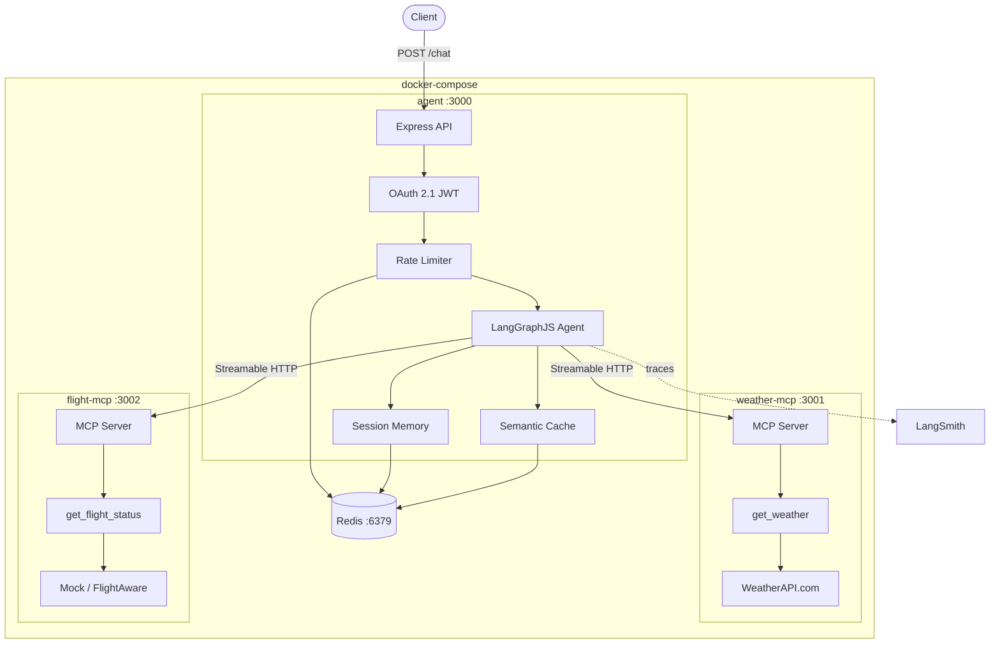

# MCP Reliability Playbook

**How to build agentic solutions with MCP that survive in production.**

> Companion repository for the Medium article: [MCP Reliability Playbook](https://medium.com/@altyurin3/mcp-reliability-playbook-d6c368f7c515) — a deep dive into failure modes, resilience patterns, and production-hardening techniques for MCP-based agents.

---

## The Problem

MCP (Model Context Protocol) makes it easy to connect LLMs to external tools. But *easy to connect* is not *safe to run in production*. Real systems face:

- **Network failures** — MCP servers restart, connections go stale, DNS flakes out
- **Cascading outages** — one slow upstream saturates your thread pool, taking down everything
- **Silent data corruption** — malformed responses slip past untyped boundaries
- **Unbounded latency** — LLM calls, tool calls, and cache lookups all competing for the same request budget
- **Partial failures** — one of two tool calls fails; do you drop the entire response or return what you have?

This project answers all of these with working, tested code — not blog-post pseudocode.

## What This Project Demonstrates

A production-grade chatbot that answers weather and flight status questions (including combined queries in a single request) using two MCP servers, LangGraphJS agent orchestration, and **9 distinct reliability patterns**, each covered by automated tests.

| Pattern | What It Solves | Where to Look |
|---------|---------------|---------------|
| **Circuit breaker** | Stops calling a failing service, gives it time to recover | `src/resilience/circuit-breaker.ts` |
| **Retry with exponential backoff + jitter** | Recovers from transient failures without thundering herd | `src/resilience/retry.ts` |
| **Timeout budgets** | Bounds latency per operation; prevents thread starvation | `src/resilience/timeout.ts` |
| **Graceful degradation** | Returns partial results when one MCP server is down | `src/mcp/client.ts`, `src/agent/nodes.ts` |
| **Semantic caching** | Reduces LLM + tool calls for similar questions; TTL varies by data volatility | `src/cache/semantic-cache.ts` |
| **Chaos / fault injection** | Proves resilience patterns actually work under failure ([mcp-chaos-monkey](https://github.com/alexey-tyurin/mcp-chaos-monkey) — my original open-source framework) | `src/chaos/`, `tests/chaos/` |
| **Graceful shutdown** | LIFO cleanup within Docker's 10s stop timeout; no resource leaks | `src/utils/graceful-shutdown.ts` |
| **Stale session reconnection** | Auto-recovers when MCP server restarts mid-session | `src/mcp/client.ts` |
| **Pre-deploy evaluation gate** | Blocks deployment if tool accuracy drops below 90% or any critical failure exists | `tests/eval/` |

### Resilience Stack Composition

Every external call (MCP tools, LLM, cache) is wrapped in a precise order:

```
circuit breaker → retry with jitter → timeout → actual call
```

The order matters: the circuit breaker sees all failure modes (timeouts, retries exhausted, upstream errors). The retry fires before the circuit trips. The timeout bounds each individual attempt, not the total.

### Chaos Testing — Proving It Works

Chaos testing is powered by [**mcp-chaos-monkey**](https://github.com/alexey-tyurin/mcp-chaos-monkey) — an open-source fault injection framework for MCP pipelines that I created and published as a standalone npm package. Both **reliable-mcp** and **mcp-chaos-monkey** are my projects; I built mcp-chaos-monkey as an **original contribution** to the MCP ecosystem because no existing tool addressed systematic chaos testing for MCP-based systems. It is a reusable package that any MCP project can adopt to validate its resilience stack under realistic failure conditions.

> See the full write-up in my portfolio: [Fault Injection Framework — Chaos Engineering for MCP Pipelines (Original Contribution)](https://github.com/alexey-tyurin/my-projects).

**mcp-chaos-monkey** provides **8 fault types** across **9 injection targets**, exercised by 21 automated chaos tests in this project:

| Fault Type | What It Simulates |
|---|---|
| `latency` | Slow upstream (configurable delay) |
| `error` | HTTP 500 / 502 / 503 from upstream |
| `timeout` | Upstream hangs indefinitely |
| `connection-refused` | Service unreachable |
| `connection-drop` | Connection starts then dies mid-response |
| `rate-limit` | Upstream returns 429 with Retry-After |
| `malformed` | Corrupted JSON response body |
| `schema-mismatch` | Valid JSON with missing fields |

Faults inject at the **transport level** (HTTP fetch, Redis commands) so circuit breakers, retries, and timeouts exercise naturally — no mocking around them. This is the key design insight: by intercepting at the network boundary rather than stubbing application code, every layer of the resilience stack is validated end-to-end.

**Production safety**: chaos code is triple-guarded — `CHAOS_ENABLED` env check + `NODE_ENV !== 'production'` check + excluded from production build via `tsconfig.prod.json`.

### Evaluation Suite — Quality Gate Before Deploy

63 evaluation cases across 3 datasets, scored by 4 automated evaluators:

| Evaluator | What It Catches |
|---|---|
| **Tool selection** | Wrong tool called, missing tool, extra tool calls |
| **Latency budget** | Response exceeds time budget (tiered: cache hit < single tool < combined) |
| **Resilience** | Stack traces in user responses, unfriendly error messages, missing partial results |
| **Response quality** | LLM-judged accuracy, completeness, and tone |

The predeploy gate (`npm run predeploy`) runs typecheck + lint + 317 tests + 63 evals. Any failure blocks the merge.

## Architecture



**4 containers**, each with its own entrypoint, health check, and graceful shutdown:

| Container | Port | Purpose |
|-----------|------|---------|
| **agent** | 3000 | Express API with OAuth 2.1, rate limiting, LangGraphJS orchestration, semantic cache, session memory |
| **weather-mcp** | 3001 | MCP server (Streamable HTTP) — `get_weather` tool calling WeatherAPI.com |
| **flight-mcp** | 3002 | MCP server (Streamable HTTP) — `get_flight_status` tool (mock or FlightAware) |
| **Redis** | 6379 | Semantic cache, session memory, rate limiting |

## Test Coverage

**317 test cases** across 38 test files + **63 evaluation cases** across 3 datasets:

| Category | Files | Cases | What It Validates |
|----------|------:|------:|----|
| Unit | 34 | 285 | Agent logic, MCP servers, resilience wrappers, cache, auth, chaos framework, eval scoring |
| Integration | 2 | 11 | End-to-end MCP weather & flight servers with real Redis |
| Chaos | 2 | 21 | Circuit breaker trip/recovery, timeout exhaustion, Redis degraded mode, dual-server failure, malformed responses |
| Evaluation | 3 datasets | 63 | Tool accuracy, latency budgets, resilience contracts, response quality (including prompt injection, XSS, SQL injection edge cases) |

All tests written test-first (TDD). Non-deterministic outputs use bounded assertions, not exact string matches.

## Quick Start

### Prerequisites

- Node.js 20+
- Docker & Docker Compose
- API keys (see [Environment Variables](#environment-variables))

### Setup

```bash
# Clone and install
git clone https://github.com/alexey-tyurin/reliable-mcp.git
cd reliable-mcp
npm install

# Configure environment
cp .env.example .env
# Edit .env with your API keys (see Environment Variables below)
```

### Docker (recommended)

```bash
# Build and start all services
docker compose build
docker compose up -d

# Verify all 4 containers are healthy
docker compose ps

# Check health endpoints
curl http://localhost:3000/health  # agent
curl http://localhost:3001/health  # weather-mcp
curl http://localhost:3002/health  # flight-mcp
```

### Local Development

```bash
# Start Redis (required for cache/sessions)
docker compose up -d redis

# Start each service in separate terminals
npm run dev:weather-mcp
npm run dev:flight-mcp
npm run dev:agent
```

## Environment Variables

Copy `.env.example` to `.env` and fill in your keys:

### All Services

| Variable | Default | Description |
|----------|---------|-------------|
| `SERVICE_ROLE` | *required* | `agent`, `weather-mcp`, or `flight-mcp` |
| `PORT` | `3000` | HTTP port (3000/3001/3002 per service) |
| `REDIS_URL` | `redis://localhost:6379` | Redis connection URL |

### Agent Service

| Variable | Default | Description |
|----------|---------|-------------|
| `OPENAI_API_KEY` | *required* | OpenAI API key (for gpt-4o-mini) |
| `LANGSMITH_API_KEY` | *required* | LangSmith API key for observability |
| `OAUTH_SECRET` | *required* | JWT signing secret (min 32 chars) |
| `WEATHER_MCP_URL` | `http://localhost:3001/mcp` | Weather MCP server URL |
| `FLIGHT_MCP_URL` | `http://localhost:3002/mcp` | Flight MCP server URL |

### Weather MCP Service

| Variable | Default | Description |
|----------|---------|-------------|
| `WEATHERAPI_KEY` | *required* | [WeatherAPI.com](https://www.weatherapi.com/) API key |

### Flight MCP Service

| Variable | Default | Description |
|----------|---------|-------------|
| `FLIGHT_PROVIDER` | `mock` | `mock` (test data) or `flightaware` (live API) |
| `FLIGHTAWARE_API_KEY` | | Only required when `FLIGHT_PROVIDER=flightaware` |

### Test Only

| Variable | Default | Description |
|----------|---------|-------------|
| `CHAOS_ENABLED` | | Set to `true` to enable fault injection. **Never set in production.** |

## API Usage

### 1. Authenticate

```bash
curl -X POST http://localhost:3000/oauth/token \
  -H "Content-Type: application/json" \
  -d '{
    "grant_type": "client_credentials",
    "client_id": "default-client",
    "client_secret": "<your-OAUTH_SECRET>"
  }'
```

### 2. Send a Chat Message

```bash
# Weather query
curl -X POST http://localhost:3000/chat \
  -H "Authorization: Bearer <access_token>" \
  -H "Content-Type: application/json" \
  -d '{"message": "What is the weather in London?", "sessionId": "my-session"}'

# Flight query (mock flights: TEST001-TEST004, UA123, BA456, DL789)
curl -X POST http://localhost:3000/chat \
  -H "Authorization: Bearer <access_token>" \
  -H "Content-Type: application/json" \
  -d '{"message": "What is the status of flight UA123?", "sessionId": "my-session"}'

# Combined query — exercises parallel tool calling and result aggregation
curl -X POST http://localhost:3000/chat \
  -H "Authorization: Bearer <access_token>" \
  -H "Content-Type: application/json" \
  -d '{"message": "Weather in NYC and status of flight UA123?", "sessionId": "my-session"}'
```

### 3. Health Check

```bash
curl http://localhost:3000/health
# {"status":"ok","service":"agent","uptime":42.5}
```

## Running Tests

```bash
# TDD workflow
npm run test:watch

# By category
npm run test:unit                          # Fast, no Docker needed
npm run test:integration                   # Requires Redis
CHAOS_ENABLED=true npm run test:chaos      # Fault injection scenarios

# Evaluations
npm run eval:quick           # Tool-calling accuracy (~1 min)
npm run eval:resilience      # Resilience contract checks
npm run eval                 # Full suite (~5 min)
npm run eval -- --langsmith  # Push results to LangSmith

# Pre-deploy gate (must pass before merge)
npm run predeploy            # typecheck + lint + all tests + full eval

# Quality checks
npx tsc --noEmit             # Type check (zero errors)
npm run lint                 # Lint check (zero warnings)
```

## Monitoring & Observability

### LangSmith Tracing

All agent invocations are traced to LangSmith when `LANGCHAIN_TRACING_V2=true`:

- Root trace: `LangGraph` run with full message history
- Child traces: `route` (LLM decision), `execute_tools` (MCP calls), `respond` (final generation)
- Tags: `user:<id>`, `session:<id>`, `tool:<name>`, `cache:hit/miss`
- Metadata: latency, tools called, cache hit status, error codes

### Structured Logging

All services use pino for JSON structured logging. No `console.log`. Secrets and tokens are never logged — only metadata (user IDs, session IDs, error codes).

### Metrics

The agent tracks: cache hit/miss rates, error counts by type, circuit breaker state transitions, request latency.

## Tech Stack

| Category | Technology |
|----------|-----------|
| Runtime | Node.js 20, TypeScript 5.x (strict mode, zero `any`) |
| Agent | LangGraphJS, gpt-4o-mini via @langchain/openai |
| MCP | @modelcontextprotocol/sdk (Streamable HTTP transport) |
| HTTP | Express, helmet (strict CSP), cors |
| Auth | OAuth 2.1 (client_credentials), jose (JWT) |
| Cache | Redis (ioredis), cosine similarity on OpenAI embeddings |
| Resilience | opossum (circuit breaker), custom retry with jitter, timeout budgets |
| Chaos | [mcp-chaos-monkey](https://github.com/alexey-tyurin/mcp-chaos-monkey) — my open-source fault injection framework for MCP (8 fault types, 9 targets) |
| Observability | LangSmith tracing, pino structured logging |
| Testing | vitest (317 tests), evaluation suite (63 cases, 4 evaluators) |
| Validation | zod (env, API input, MCP schemas, responses) |

## Project Structure

```
src/
  entrypoints/     One file per Docker container
  config/          Env validation (zod), Redis client
  auth/            OAuth 2.1 JWT issuance + middleware
  agent/           LangGraphJS graph, nodes, state
  mcp/             MCP servers + client, zod schemas
  resilience/      Circuit breaker, retry, rate limiter, timeout
  chaos/           Fault injection (dev/test only, excluded from prod build)
  cache/           Semantic cache, session store
  observability/   LangSmith tracing, metrics, pino logger
  utils/           Custom errors, health endpoint, graceful shutdown
tests/
  unit/            Fast tests, no Docker needed
  integration/     Needs Redis + MCP servers
  chaos/           Failure injection scenarios
  eval/            Pre-deployment evaluation suite
    datasets/      Test case JSON files (tool-calling, edge-cases, e2e-flows)
    evaluators/    Scoring functions (tool-selection, latency, resilience, quality)
fixtures/
  flights/         Mock flight API responses
```

## License

MIT
